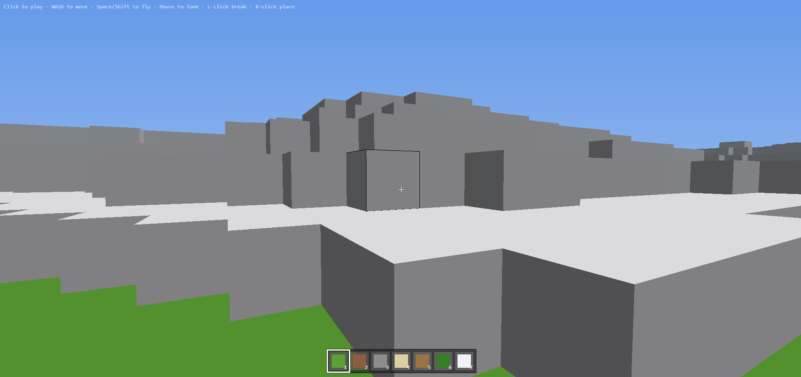

# VIW — Voxel In Web

TypeScript + WebGPU로 구현한 복셀 게임.

엔진도 그래픽스 라이브러리도 쓰지 않고, WebGPU API와 WGSL 셰이더를 직접 다뤄
지형 생성 · 청크 메싱 · 1인칭 이동 · 블록 파괴/설치를 밑바닥부터 만든다.
**동작하는 결과물보다 그 과정을 이해하는 것이 목적인 학습 프로젝트다.**



## 실행

WebGPU를 지원하는 브라우저가 필요하다 (Chrome 113+ / Edge 113+).
미지원 브라우저에서는 화면에 안내 문구만 표시된다.

```bash
npm install
npm run dev     # Vite 개발 서버
npm run build   # tsc 타입 체크 후 프로덕션 빌드
```

## 조작

| 입력 | 동작 |
| --- | --- |
| 화면 클릭 | 포인터 락 (게임 시작) |
| `W` `A` `S` `D` | 이동 |
| `Space` | 점프 |
| 마우스 이동 | 시점 회전 |
| 좌클릭 | 조준한 블록 파괴 |
| 우클릭 | 조준한 면에 블록 설치 |
| `1` ~ `7` | 핫바 블록 선택 |

## 구현된 것

- **절차적 지형 생성** — Perlin 노이즈를 fBm(5 옥타브)으로 합성해 높이맵을 만들고,
  높이에 따라 표면 블록을 눈 / 잔디 / 모래로 나눈다. 표면 아래 4칸은 흙, 그 아래는 돌
- **청크 단위 메싱** — 16×64×16 청크마다 정점 버퍼를 만든다. 인접 블록이 공기인 면만
  정점으로 만들어(face culling) 내부에 파묻힌 면은 아예 GPU로 보내지 않는다
- **블록 파괴 / 설치** — DDA 복셀 순회(Amanatides & Woo)로 시선이 처음 맞는 블록을 찾고,
  맞은 면의 법선으로 설치 위치를 정한다. 도달 거리는 6블록
- **조준 블록 하이라이트** — 단위 큐브의 12개 모서리를 `line-list`로 그린다.
  z-fighting을 피하려고 큐브를 0.002만큼 부풀린다
- **AABB 충돌 판정** — 폭 0.6 × 높이 1.8의 축 정렬 상자로 지형과 충돌한다.
  X축과 Z축을 따로 검사해 벽에 비스듬히 부딪혀도 벽을 타고 미끄러진다
- **핫바 UI** — `HOTBAR` 배열이 곧 화면 슬롯 순서이자 숫자키 번호다.
  블록 색상 견본은 `BLOCK_COLORS`에서 그대로 가져와 CSS로 변환한다

## 렌더 구조

한 프레임에 세 개의 파이프라인이 순서대로 그려진다.

1. **하늘** (`sky.wgsl`) — 정점 버퍼 없이 `draw(3)` 한 번으로 화면을 덮는 큰 삼각형 하나를
   그려 위아래 그라데이션을 칠한다. 클립 공간 z를 0.9999로 밀고 깊이 버퍼에 쓰지 않아
   항상 가장 뒤에 남는다
2. **블록** (`block.wgsl`) — 플레이어 주변 청크(반경 8)의 정점 버퍼를 순회하며 그린다.
   정점 하나는 `position(3) + normal(3) + color(3)` = 9 floats(36바이트).
   방향광(ambient 0.35 + diffuse 0.65)과 거리 기반 안개를 프래그먼트에서 계산한다
3. **하이라이트** (`highlight.wgsl`) — 조준 블록의 외곽선. 블록 위에 덮여야 하므로 마지막에

카메라 행렬 · 광원 방향 · 안개 색은 128바이트 유니폼 버퍼 하나에 묶어 매 프레임 갱신한다.
블록이 바뀌면 해당 청크의 GPU 버퍼만 버리고(`invalidateChunkAt`) 다음 프레임에 다시 만든다.

## 코드 구조

```
src/
├── main.ts         # 진입점 — 초기화, 게임 루프, 마우스 클릭(파괴/설치) 처리
├── renderer.ts     # WebGPU 초기화, 파이프라인 3종, 청크 메시 캐시
├── world.ts        # 청크 컨테이너, 월드 좌표 ↔ 청크 로컬 좌표 변환
├── chunk.ts        # 청크 지형 생성, 블록 데이터 → 정점 배열 변환(buildMesh)
├── block.ts        # 블록 타입, 면별 색상, 핫바 구성
├── noise.ts        # Perlin noise, fBm
├── player.ts       # 1인칭 카메라, 중력·점프, AABB 충돌, 입력 처리
├── raycast.ts      # DDA 복셀 레이캐스트
├── hotbar.ts       # 핫바 DOM 렌더링
├── math.ts         # 벡터 · 4×4 행렬 유틸
└── shaders/
    ├── block.wgsl
    ├── sky.wgsl
    └── highlight.wgsl
```

## 개발 방식

기능 하나를 이슈 하나로 쪼개 `<type>/<이슈번호>` 브랜치에서 작업하고,
PR을 squash merge해 main 히스토리를 이슈 단위로 남긴다.
자세한 규칙은 [CLAUDE.md](CLAUDE.md)에 있다.

학습 진행 상황은 [docs/study.md](docs/study.md)에 기록한다.
